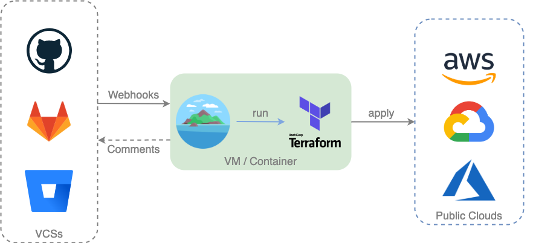
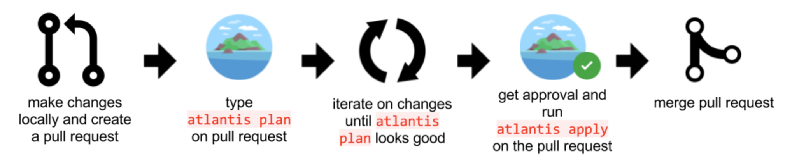
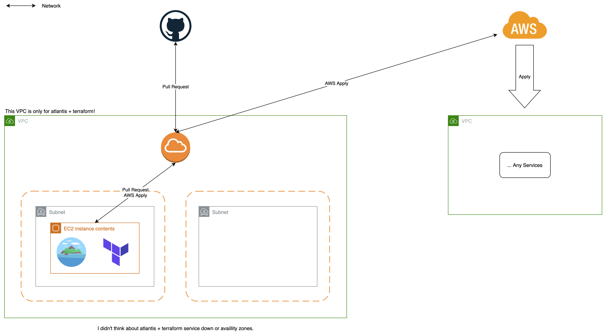

# Infrastructure as Code

## What is this?

Infrastructure as Code (IaC) is a way to process infrastructure configurations as if they were programming software

As a result, the boundary between creating an application and implementing the environment in which the application runs has begun to blur

Applications can include scripts that create and orchestrate virtual machines (VMs) on their own

This is a basic part of cloud computing and is a necessary element for DevOps

### Good Things

* Cost reduction
* Increase the speed of distribution
* Error reduction
* Increase infrastructure consistency
* Remove any changes in the composition

Infrastructure as Code supports programming management of virtual machines

There is no need to manually configure and update individual hardware

This gives infrastructure flexibility, that is, repeatability and scalability

One operator can build and manage one or 1,000 systems using the same code

Infrastructure as Code offers advantages such as fast speed, cost reduction, and risk reduction

The concept of Infrastructure as Code was the basis for DevOps' rise

As the boundary between code for running an application and code for infrastructure configuration breaks down,  
The joint work between the developer and the operator has increased

## How to use?

[Example: Create EC2 Instance - Code](./Example/ec2.tf.backup)  
[Example: Create EC2 Instance - Pull Request](https://github.com/rhea-so-lab/Infrastructure-as-Code/pull/66)

## My use case

## Reference

* [hashicorp/aws docs](https://registry.terraform.io/providers/hashicorp/aws/latest/docs)
* [how to install](https://blog.naver.com/rhea31/222654945513)

## Support Git History

### Credits

Based on these amazing projects:

* rhea by [JeongHyeon Kim](https://github.com/rhea-so)

### License

none
